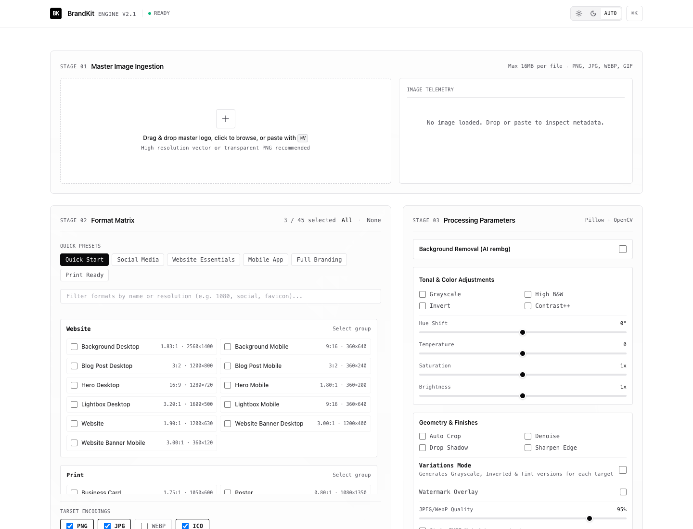

# BrandKit

Generate a complete set of brand assets (logos, banners, icons) in multiple formats and sizes from a single master image.

BrandKit is a self-hosted web utility designed to streamline the production of brand assets. Upload a master image, configure formats and preprocessing parameters, and BrandKit resizes, pads, and exports target assets for web, social, mobile, and print applications. It runs on Flask, Pillow, OpenCV, and Alpine.js, and is containerized for local or production deployments.

[](https://fabriziosalmi.github.io/brandkit/)
[](https://opensource.org/licenses/MIT)
[](https://www.python.org/downloads/)
[](https://www.docker.com/)
[](https://github.com/fabriziosalmi/brandkit/actions/workflows/ci.yml)

> **Documentation:** <https://fabriziosalmi.github.io/brandkit/>
>
> [Getting started](https://fabriziosalmi.github.io/brandkit/guide/getting-started) ·
> [Configuration](https://fabriziosalmi.github.io/brandkit/reference/configuration) ·
> [HTTP endpoints](https://fabriziosalmi.github.io/brandkit/reference/http-api) ·
> [Deployment](https://fabriziosalmi.github.io/brandkit/guide/deployment) ·
> [Security](https://fabriziosalmi.github.io/brandkit/security) ·
> [Privacy](https://fabriziosalmi.github.io/brandkit/privacy)

## Table of Contents

- [Documentation](https://fabriziosalmi.github.io/brandkit/)
- [Interface](#interface)
- [Key Features](#key-features)
- [Technology Stack](#technology-stack)
- [Quick Start](#quick-start-docker-compose)
- [Usage Guide](#usage-guide)
- [Keyboard Shortcuts](#keyboard-shortcuts)
- [Performance Features](#performance-features)
- [Configuration](#configuration-configjson)
- [File Structure](#file-structure)
- [Development](#development)
- [Docker Details](#docker-details)
- [Security Features](#security-features)
- [Deployment & Security](#deployment--security)
- [Troubleshooting](#troubleshooting)
- [Contributing](#contributing)
- [Changelog](#changelog)
- [License](#license)

## Interface



---

## Key Features

### Background Removal
* **Neural Network Segmentation:** Powered by the `rembg` library with specialized ONNX models for distinct input categories.
* **Method Selection:** Choose from Auto, Person/Portrait (`u2net_human_seg`), Object/Product (`u2net`), or Anime/Illustration modes.
* **Background Matte Controls:** Replace transparent regions with solid palette fills or preserve the alpha channel.
* **Alpha Edge Smoothing:** Morphological boundary smoothing to eliminate edge artifacts.

### Image Preprocessing Pipeline
* **Single Master Asset:** Supply one high-resolution source image (PNG, JPG, GIF, WEBP) to generate all required targets.
* **Tonal and Color Adjustments:** Grayscale, high-contrast B&W, inversion, hue shift (-180° to +180°), temperature (-100 to +100), saturation, and brightness controls.
* **Geometry and Denoising:** Automatic transparent padding cropping, bilateral noise reduction, and unsharp masking.
* **Branding Finishes:** Drop shadow synthesis with opacity/blur controls and configurable text watermarking.

### Format and Output Management
* **Catalog Coverage:** 45+ target format specifications covering web, mobile applications, social platforms, business stationery, and publishing.
* **Dominant Color Extraction:** K-means palette analysis to dynamically suggest background fills when expanding canvas aspect ratios.
* **Curated Presets:** Rapid batch selection for Social Media, Website Essentials, Mobile App, and Full Branding suites.
* **Multi-Format Export:** Simultaneous encoding to PNG, JPEG, WebP, and multi-resolution ICO favicons.
* **Archive Packaging:** Single-archive ZIP delivery with consistent naming patterns.

### Telemetry and User Experience
* **Linear / Vercel Minimalist UI:** Monochromatic high-contrast dark and light theme with automatic system preference detection and zero-FOUC persistence.
* **Live Ingestion Inspector:** Instant resolution detection, aspect ratio calculation (`16:9`, `1:1`, etc.), file weight metrics, and extracted HEX/RGB palette chip.
* **Clipboard Ingestion:** Paste screenshots or copied images directly from the clipboard via `⌘+V` / `Ctrl+V`.
* **Keyboard Navigation:** Native shortcuts (`⌘+Enter`, `Space`, `Esc`, `T`) for accelerated workflows.

### Security and Hardening
* **Local Processing:** Images are transformed on your host or container; no external API calls or third-party telemetry.
* **Defensive Controls:** CSRF protection via Flask-WTF, endpoint rate limiting via Flask-Limiter, strict Content Security Policy (CSP) headers, and mandatory EXIF stripping.
* **Automatic Eviction:** Scheduled background worker sweeps uploads and cached intermediates according to retention policies.

---

## Technology Stack

* **Backend:** Flask (Python 3.11+)
* **Background Removal:** `rembg` (ONNX Runtime, U2Net architecture)
* **Image Processing Engine:** Pillow (PIL), OpenCV, NumPy
* **Frontend:** Alpine.js, Tailwind CSS (monochrome high-contrast design system)
* **Security Middleware:** Flask-WTF, Flask-Limiter, Flask-Talisman
* **Caching and System Metrics:** Flask-Caching, psutil
* **Containerization:** Docker, Docker Compose

---

## Quick Start (Docker Compose)

The fastest method to run BrandKit is with Docker Compose:

1. **Clone the repository:**
   ```bash
   git clone https://github.com/fabriziosalmi/brandkit.git
   cd brandkit
   ```

2. **Build and launch in detached mode:**
   ```bash
   docker-compose up --build -d
   ```

3. **Open the application:**
   Navigate to [http://localhost:8000](http://localhost:8000).

4. **Generate assets:**
   Drop an image, choose format presets or individual targets, adjust preprocessing parameters, and click **Generate Brand Kit**.

5. **Stop the container:**
   ```bash
   docker-compose down
   ```

**Docker Diagnostics:**
* Verify Docker daemon status: `docker info`
* Check if port 8000 is occupied: `lsof -i :8000` (macOS/Linux) or `netstat -ano | findstr :8000` (Windows)
* Tail service logs: `docker-compose logs -f brandkit`

---

## Usage Guide

### Basic Workflow
1. **Upload:** Drag and drop an image file (PNG, JPG, GIF, WEBP, up to 16MB) onto the ingestion dropzone, click to browse, or paste directly using `⌘+V`.
2. **Background Removal (Optional):** Toggle background removal and choose an extraction model (Auto, Portrait, Product, Illustration). Select whether to keep transparency or fill with a solid tone.
3. **Preprocessing Controls:** Adjust hue, temperature, saturation, brightness, contrast, sharpness, or watermarks as required.
4. **Format Selection:** Choose individual targets, filter via the search field, or click a preset (Website Essentials, Social Media, etc.).
5. **Output Types:** Select desired file extensions (PNG, JPG, WEBP, ICO).
6. **Execution:** Click **Generate Brand Kit** or press `⌘+Enter` (`Ctrl+Enter`).
7. **Export:** Download individual files or grab the consolidated `.zip` archive.

---

## Keyboard Shortcuts

Press `⌘K` or `Shift+?` inside the interface to view all keyboard bindings:

* `Space`: Open file selector when not focused in an input.
* `⌘+Enter` or `Ctrl+Enter`: Submit form and generate brand kit.
* `⌘+V`: Paste image directly from the operating system clipboard.
* `T`: Cycle interface theme (Light, Dark, System).
* `Escape`: Cancel active processing, close open dialogs, or reset form.

---

## Performance Features

* **Content-Addressed Caching:** Intermediate operations and preprocessed masters are cached by content hash to prevent redundant transformations.
* **Resource Monitoring:** Integrated `psutil` telemetry triggers proactive garbage collection during large batch runs.
* **Scheduled Storage Sweeper:** An isolated thread purges artifacts older than `BRANDKIT_RETENTION_HOURS`.
* **Zero External Dependencies:** CSS and JavaScript are vendored locally; no third-party CDN requests are made at runtime.

---

## Configuration (`config.json`)

All format definitions, categories, and preprocessing defaults reside in `config.json`. The configuration is reloaded per request, allowing dynamic updates without server restarts.

### Schema Overview:
* **`formats`:** Object mapping format identifiers to `width`, `height`, and human-readable `description`.
* **`format_categories`:** Logical groups for organization in the matrix UI.
* **`output_formats`:** Allowed target extensions (`png`, `jpg`, `webp`, `ico`).
* **`preprocessing_options`:** Default values for slider ranges, blur radii, and watermark parameters.

---

## File Structure

```
app.py                     # Flask application factory and route handlers
image_processing.py        # Core image transformations and asset pipelines
cleanup.py                 # Background file cleanup and memory management
config_utils.py            # Format configuration and utility helpers
config.json                # Format and output configuration
requirements.txt           # Python dependencies
Dockerfile                 # Production container specification
docker-compose.yml         # Container composition
entrypoint.sh              # Container startup script
static/                    # Static assets
  uploads/                 # Output directories and local cache
  vendor/                  # Vendored Tailwind and Alpine libraries
templates/
  index.html               # Monochromatic Linear/Vercel workbench
KEYBOARD_SHORTCUTS.md      # Extended shortcut documentation
SECURITY.md                # Security policies and reporting
CONTRIBUTING.md            # Contributor guidelines
```

---

## Development

### Prerequisites

* **Python 3.11 or higher**
* **pip** (bundled with Python)
* **Git**
* **Docker & Docker Compose** (optional)

### Local Environment Setup

1. **Clone the repository:**
   ```bash
   git clone https://github.com/fabriziosalmi/brandkit.git
   cd brandkit
   ```

2. **Initialize a virtual environment:**
   ```bash
   python3 -m venv .venv
   source .venv/bin/activate  # On Windows: .venv\Scripts\activate
   ```

3. **Install dependencies:**
   ```bash
   pip install -r requirements.txt
   ```

4. **Start the application:**
   ```bash
   python app.py
   ```

5. **Open local instance:**
   Visit [http://localhost:8000](http://localhost:8000).

### Environment Variables

| Variable | Default | Purpose |
| :--- | :--- | :--- |
| `BRANDKIT_SECRET_KEY` | *(ephemeral)* | Flask session and CSRF signing key. Required for multi-worker production. |
| `BRANDKIT_MAX_UPLOAD_MB` | `16` | Maximum accepted file upload size in megabytes. |
| `BRANDKIT_CLEANUP_ENABLED` | `true` | Toggle for the background retention sweeper thread. |
| `BRANDKIT_CLEANUP_INTERVAL_HOURS` | `1` | Interval between directory cleanup sweeps. |
| `BRANDKIT_RETENTION_HOURS` | `24` | Maximum age of generated files before deletion. |
| `PORT` | `8000` | HTTP port for standalone application execution. |

---

## Docker Execution

```bash
# Build image
docker build -t brandkit .

# Run container with volume mount for uploads
docker run -p 8000:8000 -v $(pwd)/static/uploads:/app/static/uploads brandkit

# Tear down compose environment
docker-compose down
```

---

## Security Architecture

* **Content Security Policy (CSP):** Restricted script, style, and object directives via Flask-Talisman.
* **Cross-Site Request Forgery (CSRF):** Synchronizer tokens enforced on all state-changing endpoints.
* **Rate Limiting:** IP-keyed rate limits (default: 200/day, 50/hour; 5 uploads/minute) to mitigate resource exhaustion.
* **Metadata Sanitization:** Mandatory EXIF data stripping on uploaded masters before file storage.
* **Path Traversal Protection:** Canonical path inspection (`os.path.commonpath`) on download handlers.

---

## Reverse Proxy Integration

In production environments, serve BrandKit behind a TLS-terminating reverse proxy (such as Caddy or Nginx).

### Caddyfile Example:
```caddy
brandkit.your-domain.com {
    reverse_proxy 127.0.0.1:8000
}
```

### Nginx Example:
```nginx
server {
    listen 443 ssl http2;
    server_name brandkit.your-domain.com;

    ssl_certificate /etc/letsencrypt/live/brandkit.your-domain.com/fullchain.pem;
    ssl_certificate_key /etc/letsencrypt/live/brandkit.your-domain.com/privkey.pem;

    location / {
        proxy_pass http://127.0.0.1:8000;
        proxy_set_header Host $host;
        proxy_set_header X-Real-IP $remote_addr;
        proxy_set_header X-Forwarded-For $proxy_add_x_forwarded_for;
        proxy_set_header X-Forwarded-Proto $scheme;
    }
}
```

---

## Troubleshooting

### Diagnostic Checklist

* **Background removal model errors:** Ensure outbound connectivity during initial model download or pre-seed `~/.u2net/` with the appropriate ONNX files.
* **Upload permissions:** Ensure the `static/uploads` directory has write permissions (`chmod 755 static/uploads`).
* **Memory constraints:** Large image matrices require sufficient host RAM (minimum 2GB, 4GB recommended for heavy batches).
* **CSRF token invalidation:** If running behind multiple Gunicorn workers, verify that `BRANDKIT_SECRET_KEY` is explicitly set to a fixed secret.

---

## Contributing

Contributions are welcome. Please read [CONTRIBUTING.md](CONTRIBUTING.md) before submitting pull requests.

For security concerns, please refer directly to [SECURITY.md](SECURITY.md).

---

## Changelog

Detailed release notes and migration history are maintained in [CHANGELOG.md](CHANGELOG.md).

---

## License

This project is licensed under the MIT License. See [LICENSE](LICENSE) for full terms.
